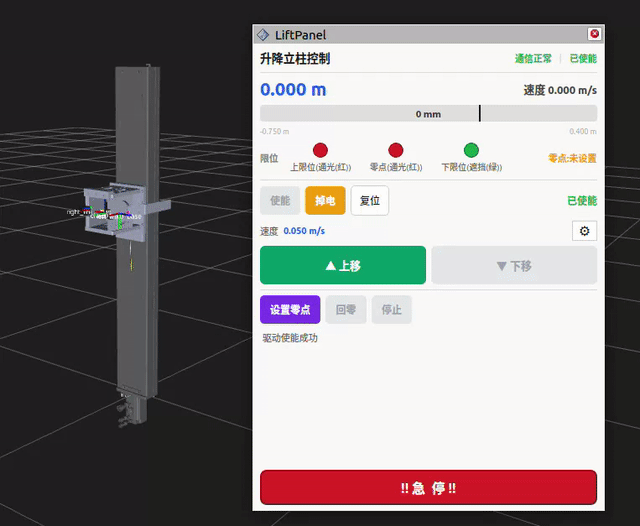

# lift_slide_panel

English | [中文](./README-CN.md)

---




An RViz2 panel plugin (Qt5) for manual control of the lift-slide mechanism.

**Plugin name:** `lift_slide_panel/LiftPanel`
**Base class:** `rviz_common::Panel`

## Features

- Real-time position display with graphical bar (zero-centered, blue=positive, orange=negative)
- Drive enable/disable control
- Homing: set zero and return home
- Manual movement: up/down buttons with short-press (step) and long-press (jog) support
- Speed slider for profile velocity adjustment
- Step size slider for position step control
- Limit switch status indicators (upper/lower/home lamps)
- Emergency stop button
- Communication and drive status indicators

## Topics Subscribed

| Topic | Type | Description |
|-------|------|-------------|
| `/lift_slide_driver/motor_status` | `lift_slide_msgs/MotorStatus` | Consolidated motor status |
| `/lift_slide_driver/homing_state` | `std_msgs/String` | Homing state changes |
| `/lift_slide_driver/limit_switch_state` | `std_msgs/String` | Limit switch state changes |

## Topics Published

| Topic | Type | Description |
|-------|------|-------------|
| `/lift_position_controller/commands` | `std_msgs/Float64MultiArray` | Position commands |
| `/lift_state_controller/profile_speed_cmd` | `std_msgs/Float64` | Profile speed setting |
| `/lift_manual_position_controller/step_command` | `std_msgs/Float64MultiArray` | Step command [direction, step_m, speed_mps] |
| `/lift_manual_position_controller/jog_command` | `std_msgs/Float64` | Jog command |

## Services Called

| Service | Type | Description |
|---------|------|-------------|
| `/lift_slide_driver/start_homing` | `std_srvs/Trigger` | Start homing sequence |
| `/lift_slide_driver/return_home` | `std_srvs/Trigger` | Return to home position |
| `/lift_slide_driver/enable` | `std_srvs/Trigger` | Enable drive |
| `/lift_slide_driver/quick_stop` | `std_srvs/Trigger` | Emergency quick stop |

## Usage

The panel loads automatically in RViz when using the bringup launch file. It can also be manually added via Panels -> Add New Panel -> lift_slide_panel/LiftPanel.

## Build

```bash
colcon build --packages-select lift_slide_panel
source install/setup.bash
```

## Prerequisites

- ROS 2 (Humble/Iron)
- rviz_common
- Qt5
- pluginlib
- lift_slide_msgs
- std_msgs, std_srvs

## License

This package is licensed under Creative Commons Attribution-NonCommercial-ShareAlike 4.0 International License (CC BY-NC-SA 4.0).

Copyright (c) 2026 Chengdu Changshu Robot Co., Ltd.

For details, please refer to the [LICENSE](LICENSE) file or visit: http://creativecommons.org/licenses/by-nc-sa/4.0/

## Acknowledgments

This package is part of the OpenFlex full-body humanoid robot platform ecosystem, developed specifically for research and industrial applications in the humanoid robotics field.

---

## 📞 Contact Us

### Chengdu Changshu Robot Co., Ltd.
**Chengdu Changshu Robotics Co., Ltd.**

| Contact | Information |
|---------|-------------|
| 📧 Email | openarmrobot@gmail.com |
| 📱 Phone/WeChat | +86-17746530375 |
| 🌐 Website | https://openarmx.com/ |
| 🌐 Docs | http://docs.openarmx.com/ |
| 📍 Address | Tianjin Xiqing District · Daochao Robot Experience Base (City of Tomorrow) · Tianjin Humanoid Robot Center |
| 👤 Contact Person | Mr. Wang |
